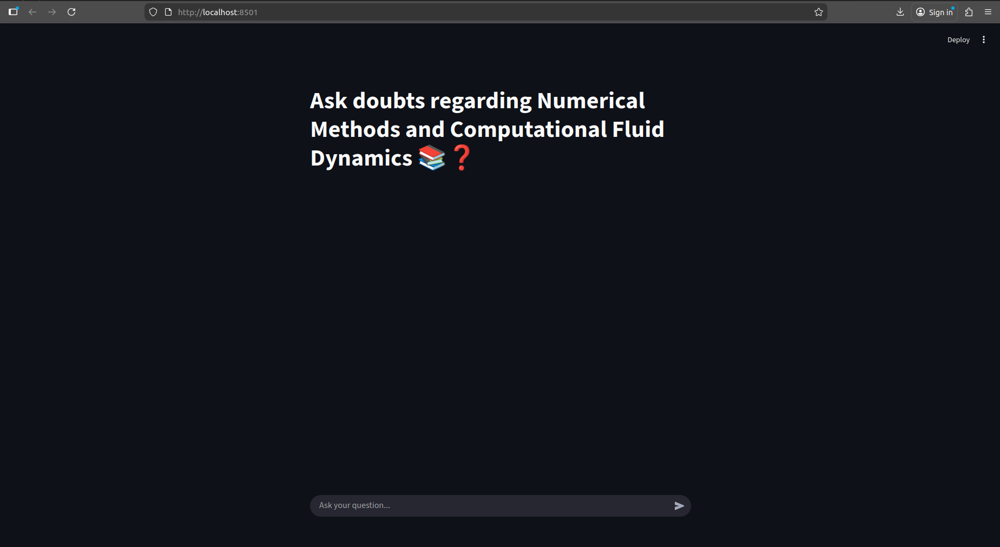

# QA Chat App for Numerical Methods and Computational Fluid Dynamics

This is an interactive web application for **context-aware question answering** over documents. It leverages **semantic search**, **LangGraph workflow**, and **ChatGroq LLM** to provide concise, source-backed answers to user queries.

---

## Features

- **Contextual Answers**: Retrieves the most relevant passages from your documents and generates answers using an LLM.
- **Conversation Memory**: Maintains chat history for follow-up questions using LangGraph's in-memory checkpointer.
- **Source Referencing**: Displays the source document and page numbers for transparency.
- **Easy-to-Use UI**: Built with Streamlit for a responsive chat experience.
- **Robust Error Handling**: Gracefully handles missing API keys, empty vector DBs, and other runtime errors.

---

## Demo

---

## Prerequisites

This project uses `uv` as the python package manager

### Install uv:

`curl -LsSf https://astral.sh/uv/install.sh | sh`

### Verify the installation:

`uv --version`

## Clone the repository or Download as zip file

`https://github.com/yoursrealkiran/RAG.git`

`cd RAG`

## Environment Setup

### Create a Virual Environment

#### In the terminal, run the below command to create a virtual environment

`uv venv`

#### Activate the environment

`source .venv/bin/activate`

#### Install Dependencies

`uv sync`

## Running the Application

### 1. Data Ingestion

Run the data ingestion script to prepare your data:

`uv run document_processing.py`

### 2. Start the Application

Paste your Groq API key in the .env file

Launch the Streamlit application:

`uv run streamlit run chatbot.py`

## Note:

- Make sure you have the required pdf files in place before running the ingestion script (document_processing.py) and change the `config.py` accordingly.
- The web app will be available in your browser once Streamlit starts.
- To deactivate the virtual environment simply run `deactivate`.

